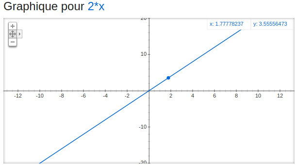

# Gradient descent

> The derivative expresses the shape of a function. Here is an example of the derivative of $f(x) = x^2$.

> The gradient is the **value** of the derivative of a function at a given point.

$f(x) = x^2$

$f'(x) = 2x$

> So if I enter 5 in $f(x) = x^2$ the gradient will be $f'(5) = 10$.
> As you can see the gradient goes in the direction of the function (here the derivative function is negative then positive just like the function is decreasing then increasing) and we want to minimize this function
> We will thus take the inverse of the gradient to minimize the output value of the function and we will multiply by a learning rate to go down little by little.

# Function of several variables

> In the case of a function or a model with several inputs, we simply take the partial derivative of the function to be minimized with respect to each variable that we want to update and that plays a role in the result of this function.
> (In our case it will be the error function that depends on the weights of the model function)

> And so to minimize the whole error function we will modify the value of each weight of the model function, and this thanks to the gradient of the partial derivatives with respect to each weight:  
> *$w_i = w_i - (a * grad_i * w_i )$*

> We will need all the gradients of the function (the error function) with respect to each weight of the model.
> Once we have updated all the weights of the error function it will be minimized

 # Important 

> It is IMPORTANT to note that here the partial derivative will be the partial derivative of the error function (and not the model function) with respect to each weight. 

> We are talking about a multivariable function here because the loss function depends on the model function and so we use the chain rule to have the gradient of the loss function with respect to the weights of the model function

> We want to minimize the loss function which depends on the model function which depends on the weights

# loss -> model -> weight

> The chain rule allows to go up the graph of loss calculation and to modify everything that makes the value of the loss vary (in this case the weights and the bias) 